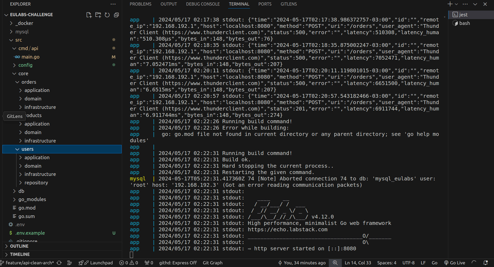

# eulabs-chalenge


## 🚀 Descrição

Este é um projeto de API desenvolvido em Go utilizando o framework Echo, seguindo os princípios de Clean Architecture. A API fornece operações CRUD para produtos e pedidos, além de autenticação de usuários com JWT.

## 🛠️ Tecnologias Utilizadas

-  [Go](https://golang.org/)
-  [Echo](https://echo.labstack.com/)
-  [Docker](https://www.docker.com/)
-  [MySQL](https://www.mysql.com/)
-  [JWT](https://jwt.io/)

## 📂 Estrutura do Projeto

```plaintext
src/
|-- cmd/
|   |-- api/
|       |-- main.go
|-- core/
|   |-- products/
|   |   |-- domain/
|   |   |   |-- model/
|   |   |       |-- product.go
|   |   |   |-- repository/
|   |   |       |-- product_repository.go
|   |   |-- application/
|   |       |-- usecase/
|   |           |-- createProduct/
|   |           |   |-- create_product_usecase.go
|   |           |-- getProduct/
|   |           |   |-- get_product_usecase.go
|   |           |-- updateProduct/
|   |           |   |-- update_product_usecase.go
|   |           |-- deleteProduct/
|   |               |-- delete_product_usecase.go
|   |   |-- infrastructure/
|   |       |-- repository/
|   |           |-- product_repository_impl.go
|   |       |-- validator/
|   |           |-- validator.go
|   |-- users/
|       |-- domain/
|       |   |-- model/
|       |       |-- user.go
|       |   |-- repository/
|       |       |-- user_repository.go
|       |-- application/
|           |-- usecase/
|               |-- registerUser/
|               |   |-- register_user_usecase.go
|               |-- loginUser/
|                   |-- login_user_usecase.go
|       |-- infrastructure/
|           |-- repository/
|               |-- user_repository_impl.go
|           |-- validator/
|               |-- validator.go
|   |-- orders/
|       |-- domain/
|       |   |-- model/
|       |       |-- order.go
|       |   |-- repository/
|       |       |-- order_repository.go
|       |-- application/
|           |-- usecase/
|               |-- createOrder/
|               |   |-- create_order_usecase.go
|               |-- getOrder/
|               |   |-- get_order_usecase.go
|               |-- updateOrder/
|               |   |-- update_order_usecase.go
|               |-- deleteOrder/
|                   |-- delete_order_usecase.go
|       |-- infrastructure/
|           |-- repository/
|               |-- order_repository_impl.go
|           |-- validator/
|               |-- validator.go
|-- go_modules/
|   |-- products/
|   |   |-- controller/
|   |   |   |-- product_controller.go
|   |   |-- dto/
|   |       |-- create_product_dto.go
|   |       |-- get_product_dto.go
|   |       |-- update_product_dto.go
|   |       |-- delete_product_dto.go
|   |-- users/
|       |-- controller/
|       |   |-- user_controller.go
|       |-- dto/
|           |-- register_dto.go
|           |-- login_dto.go
|   |-- orders/
|       |-- controller/
|       |   |-- order_controller.go
|       |-- dto/
|           |-- create_order_dto.go
|           |-- get_order_dto.go
|           |-- update_order_dto.go
|           |-- delete_order_dto.go
|-- infrastructure/
|   |-- database/
|       |-- db.go
|-- db/
|   |-- migrations/
|       |-- 0001_create_users_table.sql
|       |-- 0002_create_products_table.sql
|       |-- 0003_create_orders_table.sql
|   |-- drop_all_tables.sql
|   |-- entrypoint.sh


## 🖼️ Screenshot

Projeto em funcionamento:





📝 Pré-requisitos

.Docker
.Docker Compose Docker Compose

🚀 Como Rodar a Aplicação

Clone o repositório:

1. git clone https://github.com/MurilloAraujo9mm/eulabs-challenge.git
cd eulabs-challenge


2. Configure as variáveis de ambiente no arquivo .env:

DB_HOST=mysql
DB_PORT=3306
DB_USER=root
DB_PASSWORD=MySql2024!
DB_NAME=database_dev
JWT_SECRET=supersecretkey

🚀 Execute migrations

docker compose run migrate


🚀 Comando de rollback de migratons:

docker compose run rollback


3. Suba os containers com Docker Compose: docker-compose up --build


📬 Coleção Postman

Para facilitar o teste dos endpoints, você pode importar a coleção Postman fornecida:


🧪 Executar Testes: go test ./...


📄 Licença

Este projeto está licenciado sob a licença MIT.

👤 Contato
Nome: Murillo Araujo
Email: murilloaraujog@gmail.com
GitHub: MurilloAraujo9mm
linkedin: https://www.linkedin.com/in/murillo-araujo-393549134/details/experience/

>>>>>>> feature/refactor-struct-go
